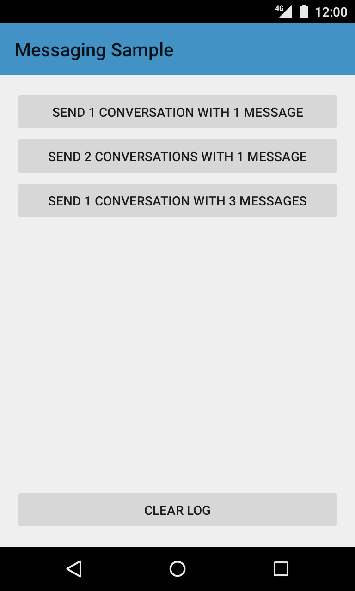
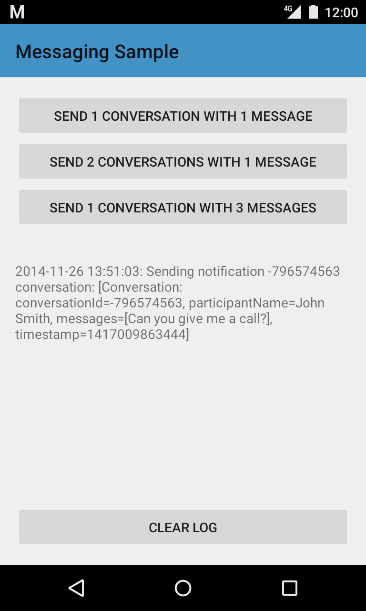
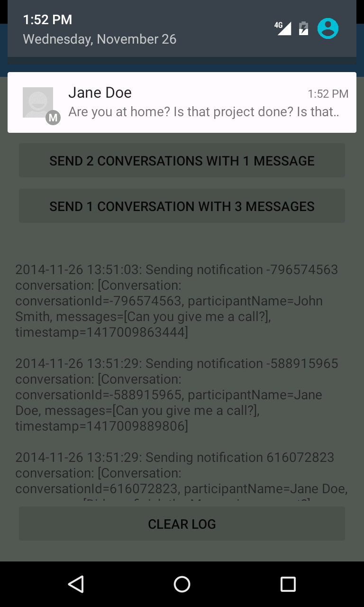

Android MessagingService Sample
===================================

This sample shows a simple service that sends notifications using
NotificationCompat. In addition to sending a notification, it also extends
the notification with a CarExtender to make it compatible with Android Auto.
Each unread conversation from a user is sent as a distinct notification.

Introduction
------------

#### Checklist while building a messaging app that supports Android Auto:
1. Ensure that Message notifications are extended using
NotificationCompat.Builder.extend(new CarExtender()...)
2. Declare a meta-data tag to your AndroidManifest.xml to specify that your app
is automotive enabled.

example: AndroidManifest.xml

```
       <meta-data android:name="com.google.android.gms.car.application"
                   android:resource="@xml/automotive_app_desc"/>
```

Include the following to indicate that the application wants to show notifications on
the Android Auto overview screen.

example: res/xml/automotive\_app\_desc.xml
```
        <automotiveApp>
            <uses name="notification"/>
        </automotiveApp>
```

#### Flow
MessagingFragment is shown to the user. Depending on the button clicked, the MessagingService is
sent a message. MessagingService in turn creates notifications which can be viewed either on the
device or in the messaging-simulator.

When a message is read, the associated PendingIntent is triggered and MessageReadReceiver is called
with the appropriate conversationId. Similarly, when a reply is received, the MessageReplyReceiver
is called with the appropriate conversationId. MessageLogger logs each event and shows them in a
TextView in MessagingFragment for correlation.

Pre-requisites
--------------

- Android SDK v23
- Android Build Tools v23.0.0
- Android Support Repository

Screenshots
-------------

   

Getting Started
---------------

This sample uses the Gradle build system. To build this project, use the
"gradlew build" command or use "Import Project" in Android Studio.

Support
-------

- Google+ Community: https://plus.google.com/communities/105153134372062985968
- Stack Overflow: http://stackoverflow.com/questions/tagged/android

If you've found an error in this sample, please file an issue:
https://github.com/googlesamples/android-MessagingService

Patches are encouraged, and may be submitted by forking this project and
submitting a pull request through GitHub. Please see CONTRIBUTING.md for more details.

License
-------

Copyright 2014 The Android Open Source Project, Inc.

Licensed to the Apache Software Foundation (ASF) under one or more contributor
license agreements.  See the NOTICE file distributed with this work for
additional information regarding copyright ownership.  The ASF licenses this
file to you under the Apache License, Version 2.0 (the "License"); you may not
use this file except in compliance with the License.  You may obtain a copy of
the License at

http://www.apache.org/licenses/LICENSE-2.0

Unless required by applicable law or agreed to in writing, software
distributed under the License is distributed on an "AS IS" BASIS, WITHOUT
WARRANTIES OR CONDITIONS OF ANY KIND, either express or implied.  See the
License for the specific language governing permissions and limitations under
the License.
